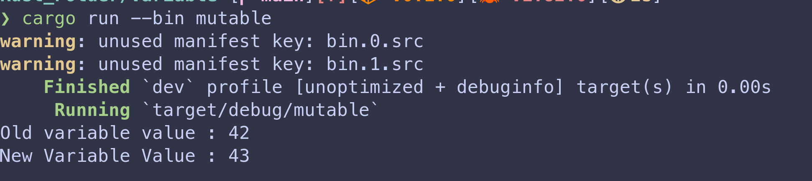
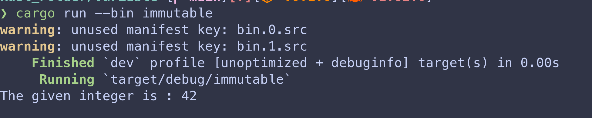

# Variables in Rust 

In rust, variables are of 2 types, 
1. Mutable
2. Immuutable

---

## Mutable Variables 

These are the variables that can be changed later on in the program i.e their value can be modified. 

Here is the code for mutable variables 

```rust 
fn main() {
    let mut variable = 42;
    println!("Old variable value : {}", variable);

    variable = variable + 1;

    println!("New Variable Value : {}", variable);
}
```
### OUTPUT



---

## Immuutable Variables

These are the variables that cannot be changed i.e their values remain constant throughout the program. 

Here is the code for immutable variables

```rust
fn main() {
    let variable: i32 = 42; //32 bit integer
    println!("The given integer is : {}", variable);
}
```

### OUTPUT 


